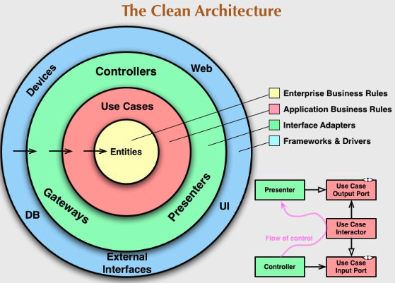

## Clean Architecture

### Goal
- Standardize and organize the developed code, favoring its reusability, as well as technology independence.

### Definitions

#### The value it can provide
- An effective testing strategy that follows the testing pyramid
- Frameworks are isolated in individual modules. When (not if) we change our mind, we only have to make a change in one place. The app has use cases rather than being tied to a CRUD system
- Screaming architecture a.k.a. it screams its intended usage. When you look at the package structure, you get a feel for what the application does rather than seeing technical details
- All business logic is in a use case, so it’s easy to find and not duplicated anywhere else
- Hard to do the wrong thing because modules enforce compilation dependencies. If you try to use something that you’re not meant to, the app doesn’t compile
- It is always ready to deploy by leaving the wiring up of the object for last. Or by using feature flags, so we get all the benefits of continuous integration
- Multiple works on stories so that different pairs can easily work on the same story at the same time to complete it quicker
- Good monolith with clear use cases that you can split in microservices later on, once you’ve learned more about them

#### Entities
- Represent your domain object
- Apply only logic that is applicable in general to the whole entity (e.g., validating the format of a hostname)
- Plain objects: no frameworks, no annotations

#### Use Cases
- Represent your business actions: it’s what you can do with the application. Expect one use case for each business action
- Pure business logic, plain code (except maybe some utils libraries)
- The use case doesn’t know who triggered it and how the results are going to be presented (for example, could be on a web page, or — returned as JSON, or simply logged, and so on.)
- Throws business exceptions

#### Interfaces / Adapters
- Retrieve and store data from and to a number of sources (database, network devices, file system, 3rd parties, and so on.)
- Define interfaces for the data that they need in order to apply some logic. One or more data providers will implement the interface, but the use case doesn’t know where the data is coming from
- Implement the interfaces defined by the use case
- There are ways to interact with the application, and typically involve a delivery mechanism (for example, REST APIs, scheduled jobs, GUI, other systems)
- Trigger a use case and convert the result to the appropriate format for the delivery mechanism
- the controller for a MVC

#### External Interfaces
- Use whatever framework is most appropriate (they are going to be isolated here anyway)